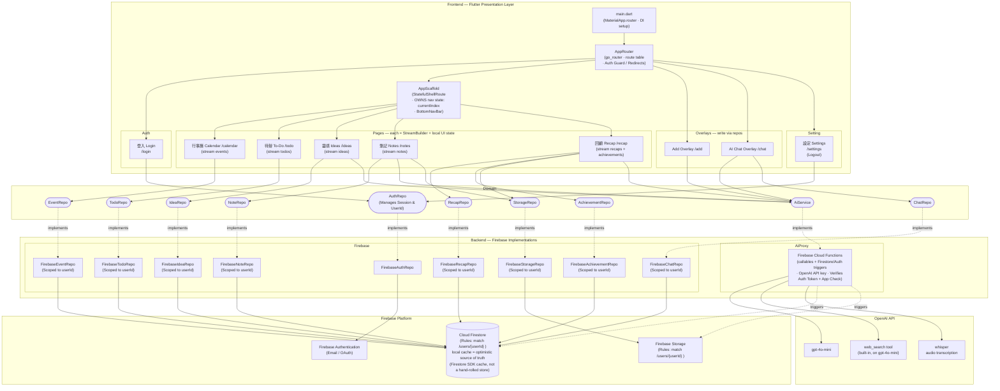

```mermaid
flowchart TB
    subgraph Frontend["Frontend — Flutter Presentation Layer"]
        Main["main.dart\n(MaterialApp.router · DI setup)"]
        Router["AppRouter\n(go_router · route table\n· Auth Guard / Redirects)"]
        Scaffold["AppScaffold\n(StatefulShellRoute\n· OWNS nav state: currentIndex\n· BottomNavBar)"]
        subgraph AuthUI["Auth"]
            Login["登入 Login\n/login"]
        end
        subgraph Pages["Pages — each = StreamBuilder + local UI state"]
            Cal["行事曆 Calendar /calendar\n(stream events)"]
            Todo["待辦 To-Do /todo\n(stream todos)"]
            Idea["靈感 Ideas /ideas\n(stream ideas)"]
            Note["筆記 Notes /notes\n(stream notes)"]
            Recap["回顧 Recap /recap\n(stream recaps + achievements)"]
        end
        subgraph Setting["Setting"]
            Settings["設定 Settings\n/settings\n(Logout)"]
        end
        subgraph Overlays["Overlays — write via repos"]
            Add["Add Overlay /add"]
            AiChat["AI Chat Overlay /chat"]
        end
    end

    subgraph Domain["Domain"]
        direction TB
            IAuthRepo(["AuthRepo\n(Manages Session & UserId)"])
            ITodoRepo(["TodoRepo"])
            IEventRepo(["EventRepo"])
            IIdeaRepo(["IdeaRepo"])
            INoteRepo(["NoteRepo"])
            IAchievementRepo(["AchievementRepo"])
            IRecapRepo(["RecapRepo"])
            IChatRepo(["ChatRepo"])
            IAiService(["AiService"])
            IStorageRepo(["StorageRepo"])
    end

    subgraph Backend["Backend — Firebase Implementations"]
        subgraph Firebase["Firebase"]
            FAuthImpl["FirebaseAuthRepo"]
            FEvent["FirebaseEventRepo\n(Scoped to userId)"]
            FTodo["FirebaseTodoRepo\n(Scoped to userId)"]
            FIdea["FirebaseIdeaRepo\n(Scoped to userId)"]
            FNote["FirebaseNoteRepo\n(Scoped to userId)"]
            FAchievement["FirebaseAchievementRepo\n(Scoped to userId)"]
            FRecap["FirebaseRecapRepo\n(Scoped to userId)"]
            FChat["FirebaseChatRepo\n(Scoped to userId)"]
            FStorage["FirebaseStorageRepo\n(Scoped to userId)"]
        end
        subgraph AiProxy["AiProxy"]
            CF["Firebase Cloud Functions\n(callables + Firestore/Auth triggers\n· OpenAI API key · Verifies Auth Token + App Check)"]
        end
    end

    subgraph FirebasePlatform["Firebase Platform"]
        FAuth["Firebase Authentication\n(Email / OAuth)"]
        FS[("Cloud Firestore\n(Rules: match /users/{userId} )\nlocal cache = optimistic source of truth\n(Firestore SDK cache, not a hand-rolled store)")]
        FSt["Firebase Storage\n(Rules: match /users/{userId} )"]
    end

    subgraph OpenAI["OpenAI API"]
        GPT["gpt-4o-mini"]
        Search["web_search tool\n(built-in, on gpt-4o-mini)"]
        Whisper["whisper\naudio transcription"]
    end

    Main --> Router
    Router --> Login & Scaffold & Setting & Add & AiChat
    Scaffold --> Cal & Todo & Idea & Note & Recap

    %% Pages talk to repos directly (state fused into the widgets)
    Login --> IAuthRepo
    Settings --> IAuthRepo
    Cal --> IEventRepo
    Todo --> ITodoRepo
    Idea --> IIdeaRepo & IAiService
    Note --> INoteRepo & IAiService & IStorageRepo
    Recap --> IRecapRepo & IAchievementRepo & IStorageRepo & IAiService
    Add --> IAiService
    AiChat --> IAiService & IChatRepo

    IAuthRepo -. implements .-> FAuthImpl
    ITodoRepo -. implements .-> FTodo
    IEventRepo -. implements .-> FEvent
    IIdeaRepo -. implements .-> FIdea
    INoteRepo -. implements .-> FNote
    IAchievementRepo -. implements .-> FAchievement
    IRecapRepo -. implements .-> FRecap
    IChatRepo -. implements .-> FChat
    IStorageRepo -. implements .-> FStorage
    IAiService -. implements .-> CF

    FAuthImpl --> FAuth
    FTodo --> FS
    FEvent --> FS
    FIdea --> FS
    FNote --> FS
    FAchievement --> FS
    FRecap --> FS
    FChat --> FS
    FStorage --> FSt
    CF --> GPT & Search & Whisper
    CF -. triggers .-> FS & FSt
```
